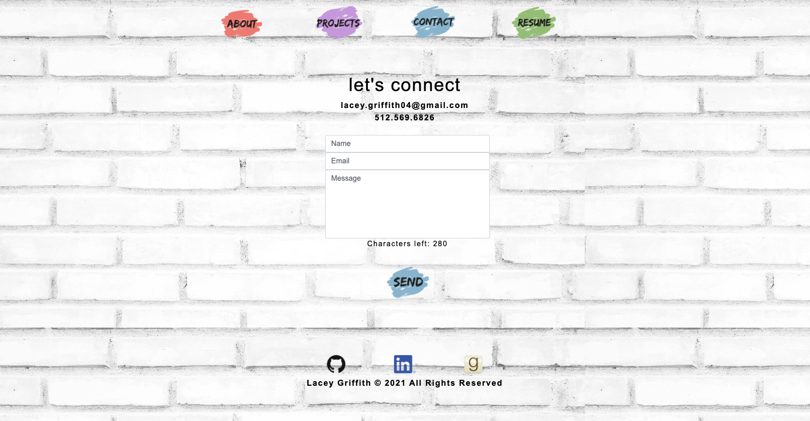

# React Portfolio

## Description
A deployed portfolio built with React showcasing my skills as a full stack developer.

## Table Of Contents
* [Usage](#usage)
* [License](#license)
* [Contributions](#contributions)
* [Questions](#questions)

## Usage
To use this application simply visit the deployed site and navigate through the site using the links provided at the top of the page. You can access the deployed site [here](https://lacey-griffith.github.io/react-portfolio/)

## Contributing
This project was created by lacey-griffith.

## Questions
If you have any questions please contact me at lacey.griffith04@gmail.com.
You can also visit my GitHub profile by clicking [here](https://github.com/lacey-griffith) and the repository for this project can be found [here](https://github.com/lacey-griffith/react-portfolio).

## Site Images
Examples of full size page rendering:

Examples of mobile view of pages:

